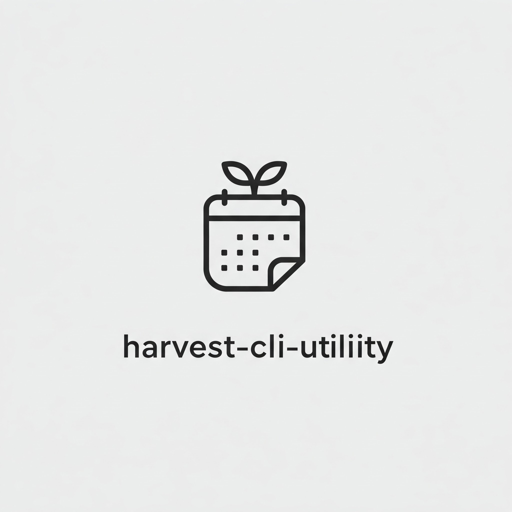

# Harvest CLI Utility

 

A simple command-line utility for logging time entries directly from your terminal to your Harvest account. This tool helps developers and teams track their time efficiently without leaving the command line.

## Features

- ✅ Create, update, delete, and list time entries directly from your terminal
- ✅ Interactive prompts with smart defaults for quick time logging
- ✅ Project and task selection from your Harvest account configuration
- ✅ Daily, weekly, and monthly time summaries with task-based aggregation
- ✅ Multiple time entry selection for batch operations
- ✅ Tabular output format for better readability
- ✅ Date filtering for all commands
- ✅ Default interactive mode for better user experience
- ✅ Configuration inspection for easy troubleshooting

## Quick Start

### Prerequisites

- Go 1.18 or higher
- A Harvest account with API access

### Installation

#### Automatic Installation

We provide installation scripts for easy setup:

**macOS/Linux:**
```bash
# Clone the repository
git clone https://github.com/amanangira/harvest-cli-utility.git

# Navigate to the project directory
cd harvest-cli-utility

# Run the installation script
chmod +x install.sh
./install.sh
```

**Windows:**
```bash
# Clone the repository
git clone https://github.com/amanangira/harvest-cli-utility.git

# Navigate to the project directory
cd harvest-cli-utility

# Run the installation script (Command Prompt)
install.bat

# Or if using Git Bash
chmod +x install.sh
./install.sh
```

The installation scripts will:
1. Check if Go is installed with the right version
2. Build the project
3. Install the binary to your PATH
4. Create a global config file at `~/.harvest-config.json` (or `%USERPROFILE%\.harvest-config.json` on Windows)
5. Create a local config.json in the current directory (for project-specific settings)
6. Provide instructions for configuration

#### Manual Installation

If you prefer to install manually:

```bash
# Clone the repository
git clone https://github.com/amanangira/harvest-cli-utility.git

# Navigate to the project directory
cd harvest-cli-utility

# Build the project
go build -o h

# Move the binary to a directory in your PATH (optional)
# For macOS/Linux:
mv h /usr/local/bin/
# For Windows (in PowerShell, run as Administrator):
# Copy-Item -Path .\h.exe -Destination "$env:USERPROFILE\bin\h.exe"

# Create a global config file
# For macOS/Linux:
cat > ~/.harvest-config.json << EOF
{
  "projects": [],
  "default_project": "",
  "default_task": "",
  "year_start_date": "01-01",
  "monthly_capacity_hours": 160,
  "billable_task_ids": [],
  "harvest_api": {
    "account_id": "YOUR_HARVEST_ACCOUNT_ID",
    "token": "YOUR_HARVEST_API_TOKEN"
  }
}
EOF
# For Windows (in PowerShell):
# Set-Content -Path "$env:USERPROFILE\.harvest-config.json" -Value "{`"projects`":[],`"default_project`":`"`",`"default_task`":`"`",`"year_start_date`":`"01-01`",`"monthly_capacity_hours`":160,`"billable_task_ids`":[],`"harvest_api`":{`"account_id`":`"YOUR_HARVEST_ACCOUNT_ID`",`"token`":`"YOUR_HARVEST_API_TOKEN`"}}"
```

### Configuration

The application looks for configuration in the following locations (in order):
1. `config.json` in the current directory (for project-specific settings)
2. In the same directory as the executable
3. `~/.harvest-config.json` (or `%USERPROFILE%\.harvest-config.json` on Windows) for global settings
4. In the parent directory

Create or edit your configuration file with your Harvest API credentials and project information:

```json
{
  "projects": [
    {
      "id": 123,
      "name": "Project A",
      "tasks": [
        {
          "id": 456,
          "name": "Software Development"
        },
        {
          "id": 678,
          "name": "Non-Billable"
        }
      ]
    }
  ],
  "default_project": "Project A",
  "default_task": "Software Development",
  "year_start_date": "01-01",
  "monthly_capacity_hours": 160,
  "billable_task_ids": [456],
  "harvest_api": {
    "account_id": "YOUR_HARVEST_ACCOUNT_ID",
    "token": "YOUR_HARVEST_API_TOKEN"
  }
}
```

#### Getting Your Harvest API Credentials

1. Log in to your Harvest account
2. Go to Settings > Developer
3. Create a new personal access token
4. Note your Account ID and Token

## Usage Guide

The CLI utility uses a simple syntax:

```
h [command] [arguments]
```

### Available Commands

#### Create a Time Entry

```bash
# Quick create with defaults
h create -D

# Interactive create (prompts for all fields)
h create

# Create with specific values
h create -d 2023-03-06 -p "Project A" -a "Software Development" -t "7:30"
```

Flags:
- `-d, --date string`: Date in YYYY-MM-DD format (default: today)
- `-p, --project string`: Project name (must match a name in config.json)
- `-a, --action string`: Action/Task name (must match a task name for the selected project)
- `-t, --duration string`: Duration in HH:MM format (e.g., "7:30" for 7 hours and 30 minutes)
- `-D, --default-mode`: Use default project and task from config

#### Delete Time Entries

```bash
# Delete entries interactively (select multiple)
h delete

# Delete entries for a specific date
h delete -d 2023-03-06

# Delete a specific entry by ID
h delete 123456789 -n
```

Flags:
- `-n, --non-interactive`: Use non-interactive mode with a time entry ID
- `-d, --date string`: Date in YYYY-MM-DD format (default: today)

**Multi-Selection Interface:**

The delete command features an intuitive multi-selection interface that allows you to:
- Select/deselect individual entries by entering their number
- Select all entries at once with 'a'
- Deselect all entries with 'n'
- Proceed with deletion with 'd'
- Cancel the operation with 'q'

This makes it easy to delete multiple time entries in a single operation.

#### Update a Time Entry

```bash
# Update an entry (select from today's entries)
h update

# Update an entry from a specific date
h update -d 2023-03-06
```

Flags:
- `-d, --date string`: Date in YYYY-MM-DD format (default: today)

#### List Time Entries

```bash
# List today's entries
h list

# List entries for a specific date
h list -d 2023-03-06

# Show weekly summary
h list -w

# Show monthly summary
h list -m

# Show yearly summary
h list -y
```

Flags:
- `-d, --date string`: Date in YYYY-MM-DD format (default: today)
- `-m, --monthly`: Show monthly summary
- `-w, --weekly`: Show weekly summary
- `-y, --yearly`: Show yearly summary (based on year_start_date in config)

**Enhanced Output:**

The list command now provides detailed task-based aggregation for all views:
- Daily view: Shows individual time entries followed by a task summary with percentages
- Weekly view: Shows project/task breakdown followed by a task-only summary across all projects
- Monthly view: Shows capacity utilization metrics, billable vs. non-billable hours, project/task breakdown with billable status, and a task-only summary across all projects
- Yearly view: Shows capacity utilization metrics, billable vs. non-billable hours, project/task breakdown with billable status, and a task-only summary across all projects for the entire year

The yearly view respects the `year_start_date` configuration option (format: "MM-DD") which lets you define when your year starts. If not specified, it defaults to January 1st (01-01).

Monthly and yearly views now include capacity utilization metrics based on the `monthly_capacity_hours` setting (defaults to 160 hours) and billable hours calculated using the `billable_task_ids` list in your configuration.

#### Check Configuration

```bash
# Display configuration file path and contents (sensitive data masked)
h config

# Display configuration with sensitive information visible
h config -s
```

Flags:
- `-s, --show-sensitive`: Show sensitive information like API tokens

## Common Workflows

### Log Time for Today

```bash
# Quick logging with defaults
h create -D

# Interactive logging
h create
```

### Review and Update Today's Entries

```bash
# List today's entries
h list

# Update an entry if needed
h update
```

### Weekly Review

```bash
# View weekly summary
h list -w

# Delete incorrect entries
h delete
```

### Batch Delete Multiple Entries

```bash
# Select the date containing entries to delete
h delete -d 2023-03-06

# Use the multi-select interface:
# - Enter numbers to select/deselect entries
# - Enter 'a' to select all
# - Enter 'd' when done
```

### Task-Based Time Analysis

```bash
# View task distribution for today
h list

# View task distribution for the week
h list -w

# View task distribution for the month
h list -m

# View task distribution for the entire year
h list -y
```

### Check Configuration Settings

```bash
# View which configuration file is being used and its contents
h config

# Troubleshoot API connection issues by viewing sensitive data
h config -s
```

### Check Utilization Metrics

```bash
# View monthly utilization metrics
h list -m

# View yearly utilization metrics
h list -y
```

In both monthly and yearly views, you'll see:
- Capacity threshold (based on monthly_capacity_hours setting)
- Total hours worked and percentage of capacity
- Billable vs. non-billable hours breakdown
- Per-task utilization with billable status

## Troubleshooting

### Common Issues

1. **API Authentication Errors**: Ensure your Harvest API credentials are correct in your config file
2. **Project/Task Not Found**: Verify that project and task names match exactly with your configuration
3. **Command Not Found**: Make sure the binary is in your PATH or use the full path to the executable
4. **Config Not Found**: Check that you have a valid config file in one of the supported locations

### Getting Help

For each command, you can use the `--help` flag to see available options:

```bash
h --help
h create --help
h delete --help
h update --help
h list --help
h config --help
```

## Contributing

Contributions are welcome! Please feel free to submit a Pull Request.

1. Fork the repository
2. Create your feature branch (`git checkout -b feature/amazing-feature`)
3. Commit your changes (`git commit -m 'Add some amazing feature'`)
4. Push to the branch (`git push origin feature/amazing-feature`)
5. Open a Pull Request

## License

This project is licensed under the MIT License - see the [LICENSE](LICENSE) file for details. 
